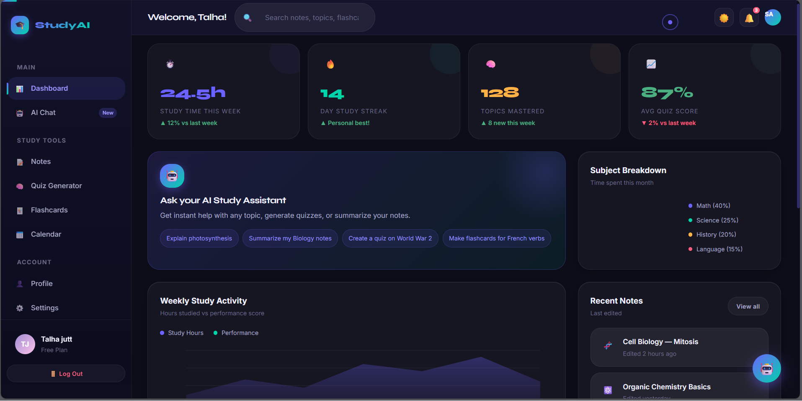
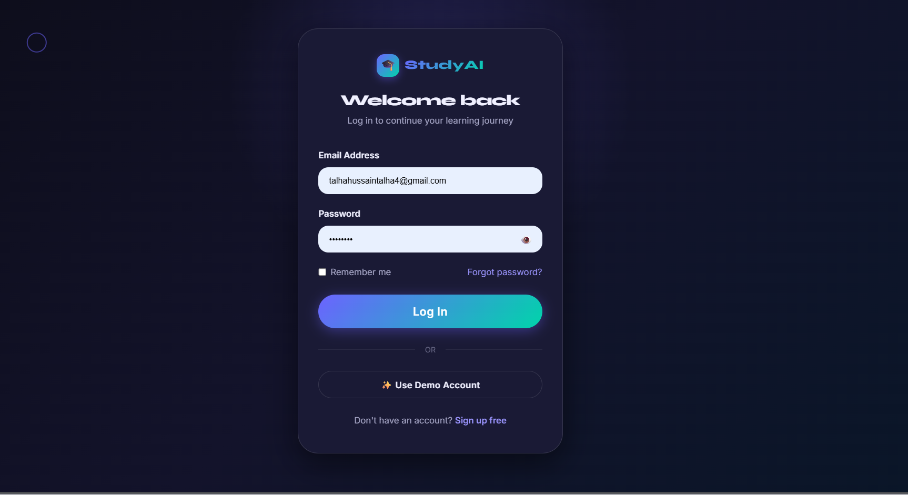
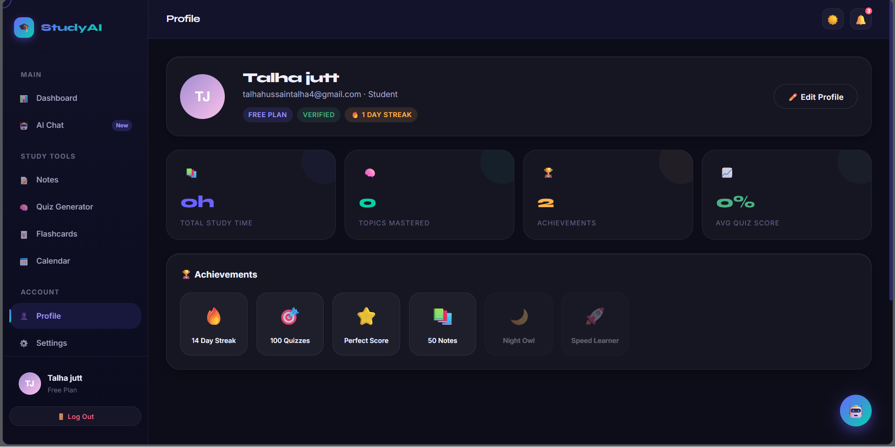
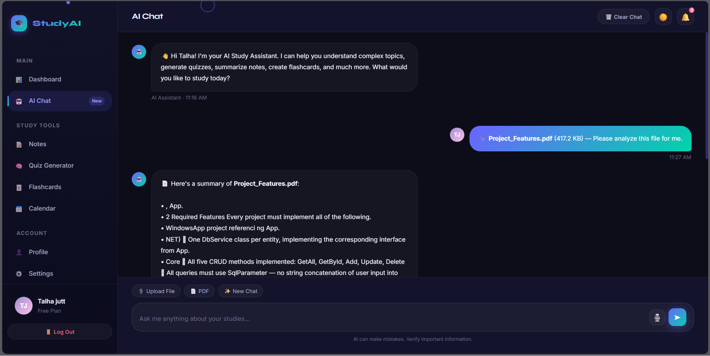
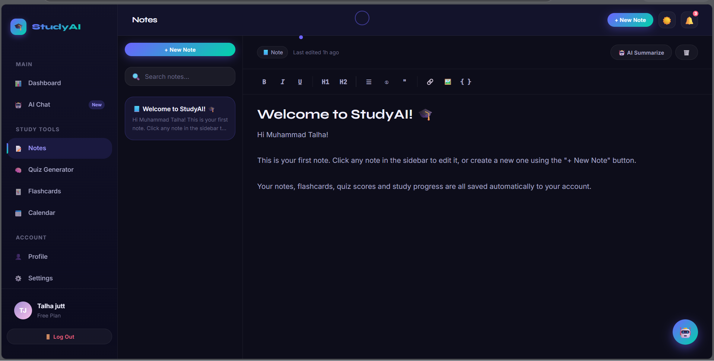
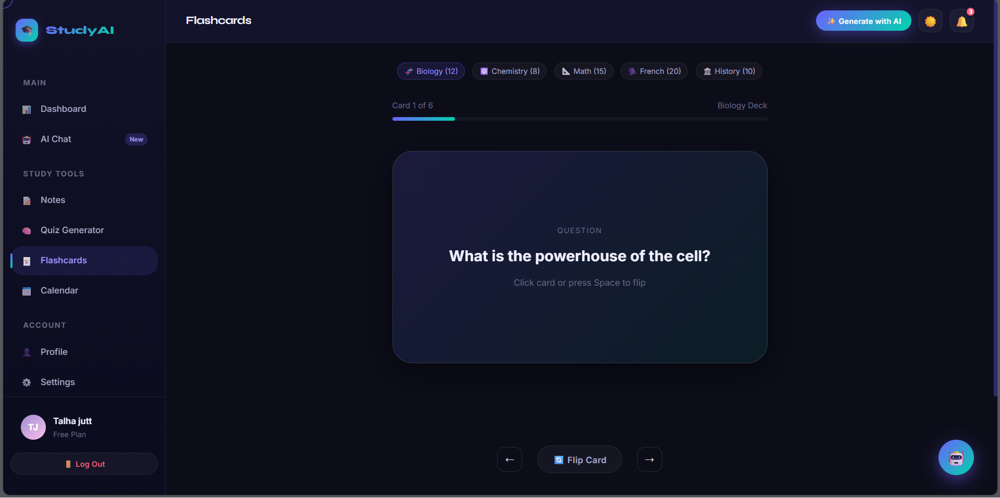
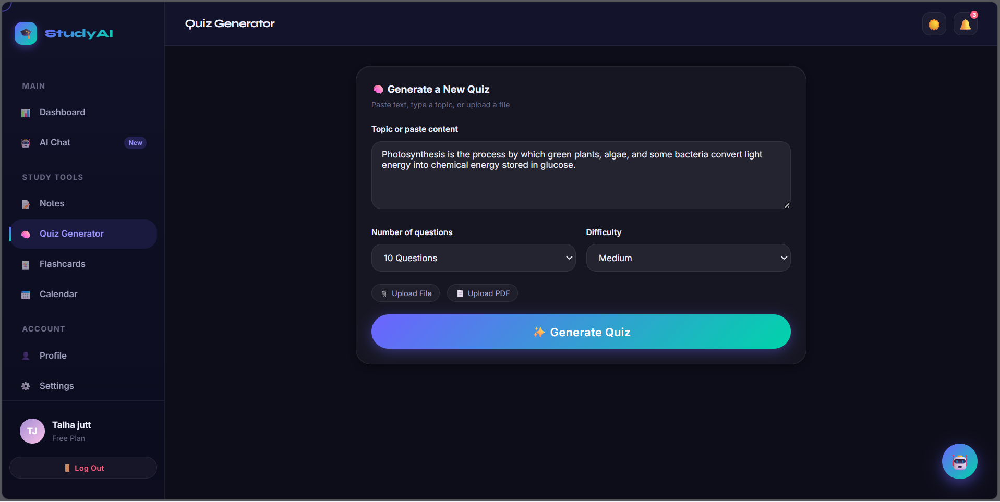
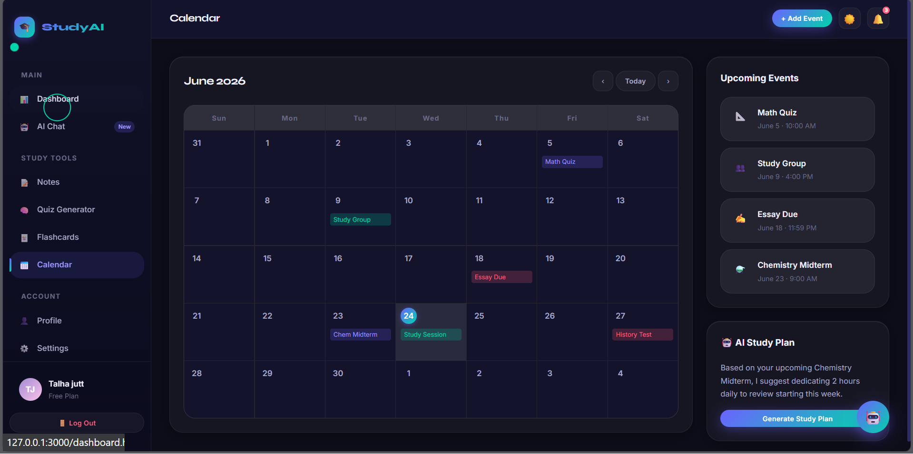
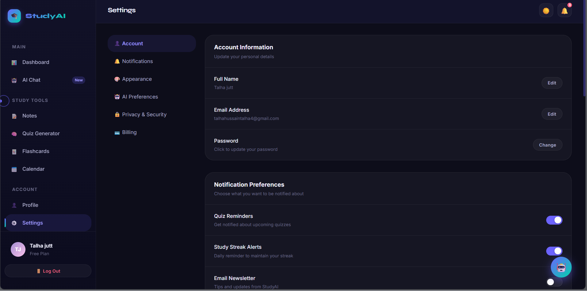

# 🎓 StudyAI — AI-Powered Study Assistant Dashboard

A premium, production-quality SaaS-style frontend for an AI Study Assistant.
Built entirely with **HTML5, CSS3 (Glassmorphism + CSS Variables), and Vanilla JavaScript** — no frameworks, no build tools required.

---

## ✨ Features

- **9 Fully Designed Pages** — Landing, Dashboard, AI Chat, Notes, Quiz Generator, Flashcards, Calendar, Profile, Settings
- **Authentication System** — Register / Login / Logout using browser `localStorage` (no backend required)
- **Per-User Data** — Every user has their own notes, quiz scores, flashcard progress, chat history, and tasks
- **AI Chat Interface** — Typing animation, suggested prompts, copy/regenerate responses, voice input
- **Real PDF/Text Summarization** — Upload a PDF or TXT file and get a real extractive summary (powered by `pdf.js`, 100% client-side)
- **Quiz Generator** — Interactive multiple-choice quizzes with live scoring, saved to user history
- **Flashcards** — 3D flip animation with spaced-repetition style difficulty rating
- **Notes Editor** — Auto-saving rich note editor with search
- **Calendar** — Full month view + mini widget with event indicators
- **Dark & Light Mode** — Theme toggle with persistence
- **Fully Responsive** — Mobile-first design, works on all screen sizes
- **Premium UI Details** — Custom cursor, scroll progress bar, glassmorphism cards, animated gradients, toast notifications, modals, skeleton loaders, micro-interactions

---

## 📸 Screenshots

### Dashboard Page

### Login Page

### Profile Page

### Ai Chatbot Page

### Notes Page

### FlashCards Page

### Quiz Generator Page

### Calender Page

### Settings Page

---

## 🛠️ Tech Stack

| Technology | Usage |
|---|---|
| HTML5 | Semantic markup, accessibility (ARIA labels) |
| CSS3 | Variables, Flexbox, Grid, Animations, Glassmorphism |
| JavaScript (Vanilla) | All interactivity, no frameworks |
| `pdf.js` (CDN) | Client-side PDF text extraction |
| `localStorage` | Authentication & per-user data persistence |

---

## 📁 Project Structure
study-assistant/
├── index.html              # Landing page
├── login.html               # Login page
├── register.html            # Registration page
├── dashboard.html            # Main dashboard
├── chat.html                 # AI chat interface
├── notes.html                 # Notes editor
├── quiz.html                  # Quiz generator
├── flashcards.html            # Flashcard study mode
├── calendar.html               # Calendar & events
├── profile.html                # User profile
├── settings.html                 # Account settings
├── css/
│   ├── variables.css           # Design tokens
│   ├── base.css                 # Reset, typography, components
│   ├── animations.css            # Keyframes & utility animations
│   ├── landing.css                # Landing page styles
│   └── dashboard.css               # App shell & dashboard styles
└── js/
├── auth.js                     # Login/register/session/per-user data
├── main.js                      # Cursor, theme, toast, modal, scroll reveal
├── dashboard.js                   # Dashboard charts & widgets
└── chat.js                         # AI chat + PDF summarization
└── screenshots/
       |__                        #All Screenshots of UI

---

## 🚀 Getting Started

1. Clone or download this repository
2. Open `index.html` in your browser (or use VS Code's **Live Server** extension for the best experience)
3. Click **Get Started Free** → Register a new account
4. Explore the dashboard, take notes, generate quizzes, and chat with the AI assistant!

### Demo Account
A demo account is auto-created the first time you visit the login page:
Email:    demo@studyai.com
Password: demo123

---

## ⚠️ Important Notes

- This is a **frontend-only demo**. There is no real backend or database — all data is stored in your browser's `localStorage`, scoped per browser/device.
- The "AI" responses in chat are simulated with pre-written variations to demonstrate the UI/UX. The **PDF/TXT summarization is real** (extractive summary, computed client-side).
- For a production app, connect this frontend to a real backend (Node/Express, Firebase, Supabase, etc.) and a real LLM API (e.g. Anthropic Claude API) for genuine AI responses.

---

## 📄 License

This project is open-source and available under the [MIT License](LICENSE).

---

## Made by:

Muhammad Talha Hussain
